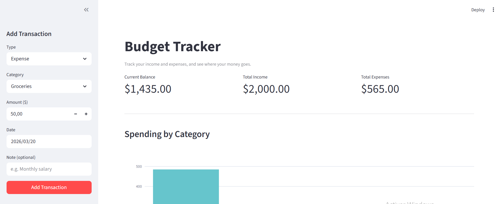
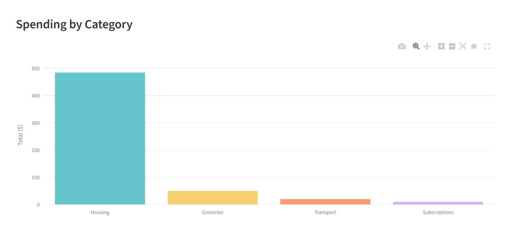

# Budget Tracker

A simple and clean budget tracking web app built with **Python** and **Streamlit** using Claude Code. It is used to log your income and expenses, visualize your spending by category, and stay on top of your finances — all stored locally in a CSV file, no database required.

---

## Preview





---

## Features

- **Add transactions** — record income or expenses with a category, amount, date, and optional note
- **Dynamic categories** — category list automatically switches between income and expense options
- **Balance overview** — see your current balance, total income, and total expenses 
- **Spending chart** — interactive bar chart showing expenses grouped by category 
- **Transaction history** — filterable and sortable table of all your transactions
- **CSV persistence** — data is saved to a local `transactions.csv` file 

---

## Getting Started

### Prerequisites

- Python 3.9 or higher

### Installation

1. **Clone the repository**

   ```bash
   git clone https://github.com/helakhaddar/Budget-tracker.git
   cd Budget-tracker
   ```

2. **Install dependencies**

   ```bash
   pip install -r requirements.txt
   ```

3. **Run the app**

   ```bash
   streamlit run app.py
   ```

4. **Open your browser** — Streamlit will automatically open the app at `http://localhost:8501`

---

## Prompt used 
This project was developed using Claude Code.  
You can explore the exact prompt used to build the application here:  
[View Prompt](Prompt.md)

---

## Project Structure

```
Budget-tracker/
├── app.py              # Main Streamlit application
├── requirements.txt    # Python dependencies
├── image/              # Screenshots for the README
└── transactions.csv    # Auto-created on first transaction (gitignored)
```

